<div align="center">

  <!-- Animated Header Banner -->
  <a href="https://github.com/garvshaw89/ArthaAI">
    
  </a>

  <br />

  <!-- Animated Live Marquee Ticker -->
  

  <br />

  <!-- Badges -->
  <p align="center">
    <a href="#tech-stack">
      
    </a>
    <a href="#tech-stack">
      
    </a>
    <a href="#tech-stack">
      
    </a>
    <a href="#tech-stack">
      
    </a>
    <a href="#gemini-ai-intelligence">
      
    </a>
    <a href="#tech-stack">
      
    </a>
    <a href="#license">
      
    </a>
  </p>

  <p align="center">
    <strong>An institutional-grade algorithmic trading simulator, AI market intelligence platform, and precision wealth modeler built with React 19, TypeScript, Express, and Google Gemini.</strong>
  </p>

  <p align="center">
    <a href="#quickstart">Quickstart</a> •
    <a href="#key-features">Key Features</a> •
    <a href="#system-architecture">System Architecture</a> •
    <a href="#strategy-engine">Strategy Engine</a> •
    <a href="#sip-calculator">SIP Calculator</a> •
    <a href="#api-reference">API Reference</a> •
    <a href="#license">License</a>
  </p>
</div>

---
# Live Project:
## https://demo-arthai-app.vercel.app/

## ⚡ Overview

**ArthaAI** bridges the gap between institutional algorithmic trading and retail wealth planning. It integrates a continuous 3-second tick engine simulating real NSE/BSE equity shifts, server-side algorithmic rule execution, real-time macro sentiment powered by Google Gemini, an interactive SIP/Lumpsum wealth forecaster, and simulated virtual portfolio accounting.

---

## 🎯 Key Features

### 1. 🤖 Algorithmic Strategy Execution Engine
- **Autonomous Rule Evaluation**: Evaluates custom trading rules continuously against incoming market ticks.
- **Trigger Condition Types**:
  - `PRICE_UP_PERCENT_HOUR`: Trigger BUY/SELL when a stock surges by $X\%$ within the last 60 minutes.
  - `PRICE_DROP_PERCENT_DAY`: Trigger BUY/SELL when a stock dips by $X\%$ in the current session (e.g. buy-the-dip).
  - `PRICE_CROSS_ABOVE`: Trigger BUY when market price crosses a specific rupee resistance level.
  - `PRICE_CROSS_BELOW`: Trigger STOP-LOSS or short sell when price breaches support.
- **Instant Order Simulation**: Automatically logs executed orders with execution timestamp, trigger reason, execution price, quantity, and total value.
- **Order Execution Latency**: `< 3ms` local rule evaluation latency.

### 2. 🧠 Google Gemini AI Market Sentiment Core
- **Macro Sentiment Analysis**: Ingests real-time market data and synthesizes Bullish / Neutral / Bearish outlooks with numeric sentiment confidence scores.
- **Institutional & FII/DII Tracking**: Monitors smart-money flow signals, index resistance barriers, and sectoral rotations.
- **Graceful Fallback**: Operates reliably in offline/simulated mode when API keys are absent, and seamlessly upgrades to live Gemini reasoning once `GEMINI_API_KEY` is provided.

### 3. 📊 High-Precision SIP & Lumpsum Wealth Modeler
- **Dual Calculation Modes**:
  - **Returns Mode**: Projects future accumulated wealth given monthly SIP or Lumpsum amount, expected annual return, and tenure.
  - **Target Wealth Mode**: Solves inversely for the exact required monthly SIP required to achieve a target financial goal (e.g., ₹1 Crore).
- **Annual Step-Up Compounding**: Simulates annual investment increments (e.g., $+10\%$ per year as income grows) with realistic compounding trajectory visualization.
- **Rule of 72 Insights**: Instantly computes expected capital doubling timeframes based on the selected risk profile.

### 4. 📈 Real-Time Market Ticker & Live Sparkline Charts
- **Index Tracking**: Live updates for NIFTY 50, SENSEX, and BANK NIFTY with session points and percentage change.
- **Interactive Ticks**: High-frequency price chart rendering AI forecast bands, historical trends, and multi-timeframe views (`1D`, `1W`, `1M`, `1Y`).
- **One-Click Stress Tester**: Inject controlled market volatility (e.g., Spike Tata Motors $+5.2\%$ in 1 hour or Drop Infosys $-2.5\%$) to verify rule triggers in real time.

### 5. 💼 Virtual Portfolio & Live Ledger
- **Cash Management**: Starting capital of ₹1,00,000 allocated for paper trading.
- **Real-Time PnL**: Tracks unrealized returns, weighted average purchase cost, and net portfolio valuation as market ticks fluctuate.

---

## 🏗️ System Architecture

<div align="center">
  
</div>

The platform employs a reactive, unidirectional data flow:
1. **Tick Ingestion**: A background timer in `server.ts` generates synchronized ticks every 3,000ms with realistic Brownian random-walk perturbations.
2. **Rule Matrix Evaluator**: Strategy rules are evaluated synchronously against each stock's `price`, `hourlyChangePercent`, and `dailyChangePercent`.
3. **Execution Engine**: When a threshold is met, a `TradeOrder` is created, logged to the trade ledger, and applied directly to the `PortfolioSummary`.
4. **Client Synchronizer**: The React frontend receives the latest market state via polling or simulated tick injections with smooth motion animations.

---

## 🚀 Quickstart

### Prerequisites
- **Node.js**: `v18.0.0` or higher
- **npm** or **bun**: `npm v9+`

### Installation

```bash
# 1. Clone the repository
git clone https://github.com/garvshaw89/ArthaAI.git

# 2. Navigate to the project root
cd ArthaAI

# 3. Install dependencies
npm install

# 4. Configure environment variables (optional for AI live reasoning)
cp .env.example .env
```

### Setting up `.env`

Edit `.env` to supply your Gemini API key (optional):

```env
GEMINI_API_KEY="your-google-gemini-api-key"
APP_URL="http://localhost:3000"
```

> **Note**: The application includes built-in fallback market intelligence so all features, charts, calculators, and strategy triggers run offline without requiring an active API key!

### Running the Application

```bash
# Start the full-stack development server (Express + Vite on Port 3000)
npm run dev
```

Open [http://localhost:3000](http://localhost:3000) in your browser.

---

## 🛠️ Tech Stack

| Layer | Technologies |
| :--- | :--- |
| **Frontend Framework** | [React 19](https://react.dev/) + [Vite 6](https://vitejs.dev/) |
| **Language** | [TypeScript 5.8](https://www.typescriptlang.org/) |
| **Styling** | [Tailwind CSS 4](https://tailwindcss.com/) (Design Token System) |
| **Icons & Motion** | [Lucide React](https://lucide.dev/) & [Motion](https://motion.dev/) |
| **Backend Server** | [Express 4](https://expressjs.com/) (TypeScript via `tsx` & `esbuild`) |
| **Artificial Intelligence** | [@google/genai SDK](https://www.npmjs.com/package/@google/genai) (Gemini 2.5 Flash) |
| **Bundling & Production** | `esbuild` bundled CommonJS server (`dist/server.cjs`) |

---

## 📡 API Reference

### Market Data Endpoints

#### `GET /api/indices`
Returns the latest benchmark indices (NIFTY 50, SENSEX, BANK NIFTY).
```json
[
  {
    "symbol": "NIFTY",
    "name": "NIFTY 50",
    "value": 22456.70,
    "change": 189.20,
    "changePercent": 0.85
  }
]
```

#### `GET /api/stocks`
Returns live quotes for all tracked equities with 20-point historical ticks and 1h/1d momentum values.

#### `POST /api/simulate-tick`
Injects manual price movement for testing algorithm triggers.
```json
// POST /api/simulate-tick
{
  "symbol": "TATAMOTORS",
  "direction": "SPIKE_UP",
  "percent": 5.2
}
```

---

### Strategy & Trading Endpoints

#### `GET /api/strategies`
Fetches all active and paused automated trading rules.

#### `POST /api/strategies`
Creates a new automated trading rule.
```json
{
  "name": "Buy Tata Motors on +5% 1h Surge",
  "symbol": "TATAMOTORS",
  "conditionType": "PRICE_UP_PERCENT_HOUR",
  "threshold": 5.0,
  "action": "BUY",
  "quantity": 10,
  "active": true
}
```

#### `POST /api/strategies/:id/toggle`
Toggles an automated trading rule between `active` and `paused`.

#### `GET /api/trade-logs`
Returns the historical ledger of all algorithmically executed orders.

#### `GET /api/portfolio`
Returns current available cash balance, open stock holdings, and unrealized profit/loss.

---

### Intelligence & Calculation Endpoints

#### `GET /api/sentiment`
Retrieves AI market sentiment, key bullish/bearish factors, and institutional signals.

#### `POST /api/calculate-sip`
Server-side high-precision compound interest and step-up calculator.
```json
// Request
{
  "type": "SIP",
  "amount": 10000,
  "periodYears": 10,
  "expectedReturn": 12,
  "stepUpPercent": 10
}

// Response
{
  "totalInvested": 1912491,
  "estimatedTotalValue": 3524678,
  "estimatedReturns": 1612187,
  "doublingYears": 6
}
```

---

## 🧮 Financial Formulas

### Future Value of Systematic Investment Plan (SIP)
For monthly investment $P$, monthly rate $i = \frac{r}{12 \times 100}$, and total months $n = t \times 12$:

$$FV = P \times \frac{(1 + i)^n - 1}{i} \times (1 + i)$$

### Future Value of Lumpsum Investment
For initial principal $P_0$, annual rate $r$, and compounding periods $t$:

$$FV = P_0 \times \left(1 + \frac{r}{100}\right)^t$$

### Rule of 72 (Doubling Time)
The approximate number of years required to double invested capital at annual rate $r$:

$$T_{\text{double}} \approx \frac{72}{r}$$

---

## 📂 Project Structure

```
ArthaAI/
├── assets/
│   ├── readme-banner.svg         # Animated GitHub banner header
│   ├── readme-ticker.svg         # Animated stock ticker marquee
│   └── readme-architecture.svg   # Animated system architecture diagram
├── src/
│   ├── components/
│   │   ├── AISentimentCard.tsx   # Gemini macro sentiment card
│   │   ├── ActiveSignals.tsx     # Live stock watchlist & trigger actions
│   │   ├── CategoryBar.tsx       # Filter by Asset Class
│   │   ├── FeaturedForecast.tsx  # Interactive SVG tick chart & projection
│   │   ├── Header.tsx            # Global navigation & live system clocks
│   │   ├── LiveMarquee.tsx       # Live scrolling index header bar
│   │   ├── MarketPulse.tsx       # Institutional headlines & FII updates
│   │   ├── Navigation.tsx        # Bottom / mobile dock navigation
│   │   ├── SIPCalculatorModal.tsx# SIP & Lumpsum interactive modal
│   │   └── StrategyEngineView.tsx# Algorithmic rules, tester & trade logs
│   ├── App.tsx                   # Main layout container & state sync
│   ├── index.css                 # Tailwind CSS 4 configuration
│   ├── main.tsx                  # Client entry point
│   └── types.ts                  # Shared TypeScript interfaces & types
├── .env.example                  # Environment variable blueprint
├── metadata.json                 # AI Studio configuration & permissions
├── package.json                  # Dependencies, build scripts & engine config
├── server.ts                     # Express server & algorithmic trading engine
├── tsconfig.json                 # TypeScript compiler specifications
└── vite.config.ts                # Vite frontend bundler configuration
```

---

## 🔒 Security & Best Practices

- **Zero Client-Side Secrets**: All Gemini API keys are maintained strictly server-side in `server.ts` and never leaked to the browser bundle.
- **Graceful Fault Tolerance**: If the Gemini API service is unreachable or rate-limited, the system falls back to algorithmic deterministic market analysis.
- **Type Safety**: Strictly enforced TypeScript interfaces shared across both the Express backend and React components.

---

## 🤝 Contributing

Contributions, issues, and feature requests are welcome!

1. Fork the Project
2. Create your Feature Branch (`git checkout -b feature/AlgorithmicIndicator`)
3. Commit your Changes (`git commit -m 'Add Exponential Moving Average Strategy Rule'`)
4. Push to the Branch (`git push origin feature/AlgorithmicIndicator`)
5. Open a Pull Request

---

## 📄 License

Distributed under the **MIT License**. See `LICENSE` for more information.

<div align="center">
  <sub>Built with ❤️ for precision trading and intelligent financial planning.</sub>
</div>
